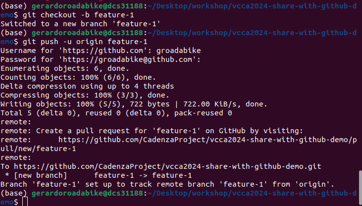
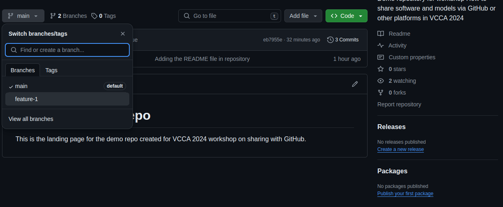
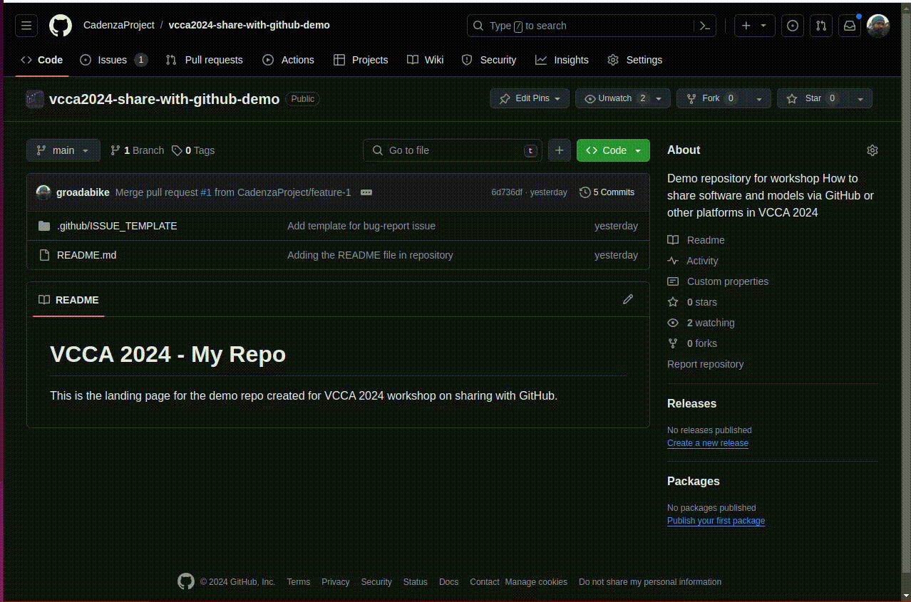
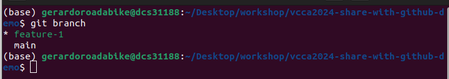

# Branching the code

As we just saw, after protecting our `main` branch, we can't push directly to it.
We need to create a new branch and then create a pull request to merge it into `main`.

Wether you are working on a forked repository or a repository where you have write access, 
it is a good practice to create a new branch for each new feature or bug fix. 

Here, we will create a new branch called `feature-1` and push some changes to it.

The recommended procedure to work on a new feature or bug fix is as follows:

1. On the GitHub page, create an `ISSUE` with much information as you can provide. 


## Create a new branch

There are several ways to create a new branch in GitHub.

1. Using the Git command line
2. Using the GitHub web interface
3. Directly from an issue.


### Using the Git command line

1. Clone the repository to your local machine (if you haven't already).
```bash
git clone https://github.com/username/<repo name>git
cd <repo name>
```

2. Create a new branch using the `git checkout -b <branch-name>` command.
It is important to give the branch a descriptive name that indicates the purpose of the branch.

```bash
git checkout -b feature-1
```
This command creates a new branch called `feature-1` and switches to it.

3. Push the new branch to the remote repository.
```bash
git push -u origin feature-1
```
The `-u` flag sets the remote branch as the upstream branch for the local branch,
so in the future, you can simply use git push without specifying the branch.



4. Verify that the new branch has been created on GitHub by visiting the repository page,
clicking on the "Branch" dropdown, and selecting the new branch.



:::{admonition} git switch
:class: important
The `git checkout` command is used to switch branches in Git.
However, starting from Git version 2.23, a new command `git switch` was introduced to switch branches.
So, you can also use `git switch <branch-name>` to switch branches.

For creating a new branch, you can use `git switch -c <branch-name>` instead of `git checkout -b <branch-name>`.

The `git switch` command is more intuitive and user-friendly than `git checkout`.

For our use case, you won't see any difference between the two commands.
:::

### Using the GitHub web interface

1. Navigate to the repository on GitHub.
2. Open the "Branch" dropdown and type the name of the new branch in the text box.
You will see an option to create a new branch from the current branch.
 Click the button to create the branch.



### Directly from an issue

If you have created an issue on GitHub, you can create a new branch directly from the issue page.
On the issue page, at the left sidebar, you will see a button to create a new branch.


## Making changes to the new branch

Now that we have created a new branch, we can make changes to the codebase 
without affecting the `main` branch. Before, we need to be sure that we are 
working on the correct branch. To check the current branch, use the `git branch` command.

```bash
git branch
```

The output will show the current branch with an asterisk (`*`) next to it and a list
of all branches in the repository.



To switch to a different branch, use the `git checkout <branch-name>` command
or `git switch <branch-name>` if you are using Git version 2.23 or later.

```bash 
git switch feature-1
```

Now, you can make changes to the codebase, commit them, and push them to the remote repository.
Let's try again to create the issue template and push it to the `feature-1` branch.

1. Create the issue template as described in the previous section.
2. Add and commit the changes to your repository.
3. Push the changes to the remote repository.


