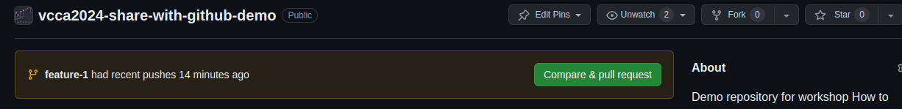
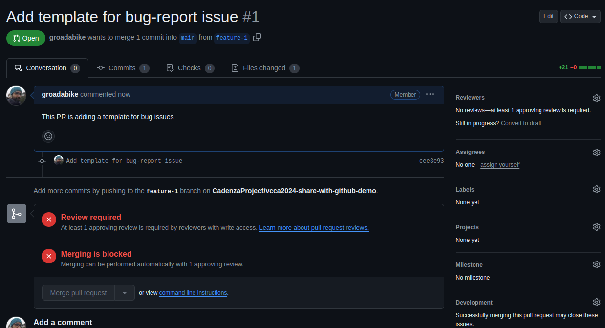
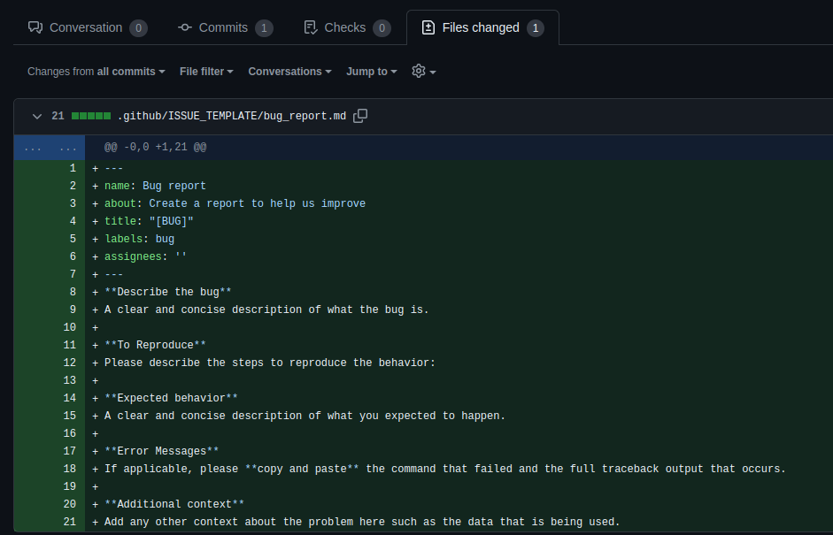
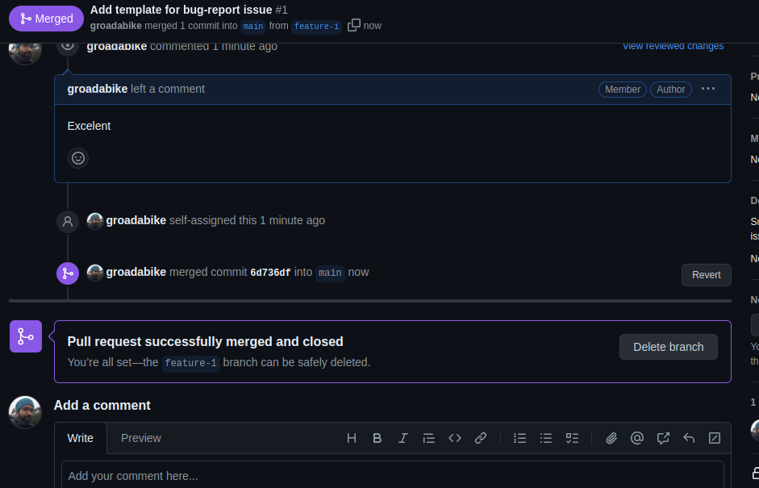

# Branching the code

As we just saw, after protecting our `main` branch, we can't push directly to it.
We need to create a new branch and then create a pull request to merge it into `main`.

Wether you are working on a forked repository or a repository where you have write access, 
it is a good practice to create a new branch for each new feature or bug fix. 

Here, we will create a new branch called `feature-1` and push some changes to it.

The recommended procedure to work on a new feature or bug fix is as follows:

1. Create an `ISSUE` that describes what you want to do. Issues are not only for errors, 
but also for new features, improvements, and other tasks. 

## Create a new branch

Creating a new branch in GitHub can be done using the Git command line or
directly through the GitHub web interface. Here are the steps for both methods:

### Using the Git command line

1. Clone the repository to your local machine (if you haven't already).
```bash
git clone https://github.com/username/<repo name>git
cd <repo name>
```

2. Create a new branch using the `git checkout -b <branch-name>` command.
```bash
git checkout -b feature-1
```
This command creates a new branch called `feature-1` and switches to it.

3. Push the new branch to the remote repository.
```bash
git push -u origin feature-1
```
The `-u` flag sets the remote branch as the upstream branch for the local branch,
so in the future, you can simply use git push without specifying the branch.


4. Verify that the new branch has been created on GitHub by visiting the repository page,
clicking on the "Branch" dropdown, and selecting the new branch.


:::{admonition} git switch
class: important
The `git checkout` command is used to switch branches in Git.
However, starting from Git version 2.23, a new command `git switch` was introduced to switch branches.
So, you can also use `git switch <branch-name>` to switch branches.

For creating a new branch, you can use `git switch -c <branch-name>` instead of `git checkout -b <branch-name>`.

The `git switch` command is more intuitive and user-friendly than `git checkout`.

For our use case, you won't see any difference between the two commands.
:::

### Using the GitHub web interface

1. Navigate to the repository on GitHub.
2. Open the "Branch" dropdown and type the name of the new branch in the text box.
You will see an option to create a new branch from the current branch.
 Click the button to create the branch.

## Making changes to the new branch

Now that we have created a new branch, we can make changes to the codebase without affecting the `main` branch.
Before, we need to be sure that we are working on the correct branch.
To check the current branch, use the `git branch` command.

```bash
git branch
```

The output will show the current branch with an asterisk (`*`) next to it and a list
of all branches in the repository.


To switch to a different branch, use the `git checkout <branch-name>` command
or `git switch <branch-name>` if you are using Git version 2.23 or later.

```bash 
git switch feature-1
```

Now, you can make changes to the codebase, commit them, and push them to the remote repository.
Let's try again to create the issue template and push it to the `feature-1` branch.

1. Create the issue template as described in the previous section.
2. Add and commit the changes to your repository.
3. Push the changes to the remote repository.


## Creating a pull request (PR)

After making changes to the `feature-1` branch, you can create a pull request to merge the changes into the `main` branch.
If you go to GitHub webpage, you will see a message saying that you have recently pushed a new branch and a button to create a pull request.



Click on the "Compare & pull request" button to start the process.

On the Open a pull request page, you will see a form to fill out with information about your PR.
You can add a title and description to explain the changes you made in the branch.



After filling out the form, click on the "Create pull request" button to submit the PR.
However, before merging the PR, you need to wait for the code to be reviewed by other collaborators.

:::{admonition} Best Practices

:class: attention

* **Create a descriptive title**: The title should summarize the changes made in the PR.
* **Add a detailed description**: Explain the purpose of the changes, why they were made, and any relevant information.
* **Assign reviewers**: Assign one or more reviewers to the PR to ensure that the code is reviewed before merging.
* **Add labels**: Use labels to categorize the PR (e.g., bug fix, feature, documentation).
* **Link issues**: If the PR is related to an issue, link the issue in the description.
* **Keep the PR small**: Try to keep the changes in a PR small and focused on a single task.
* **Respond to feedback**: If reviewers provide feedback, address their comments and make the necessary changes.

:::

## Reviewing a pull request

When a pull request is created, other collaborators can review the changes and provide feedback.
If collaborators ask you to make changes to the PR, you can make the changes locally, commit them, and push them to the same branch.
The changes will automatically be added to the PR.

To review a PR, click on the "Files changed" tab to see the differences between the branches.
You can leave comments on specific lines of code, ask questions, or suggest improvements.



The `+` and `-` symbols indicate lines that have been added or removed, respectively.

## Merging the pull request

Once the changes have been reviewed and approved, you can merge the PR into the `main` branch.
To merge the PR, click on the "Merge pull request" button on the PR page.

You will see a confirmation dialog asking you to confirm the merge.
Click on the "Confirm merge" button to merge the changes.

After the PR is merged, you can delete the branch if it is no longer needed.
Click on the "Delete branch" button to remove the branch from the repository.



After merging the PR, the changes will be reflected in the `main` branch.