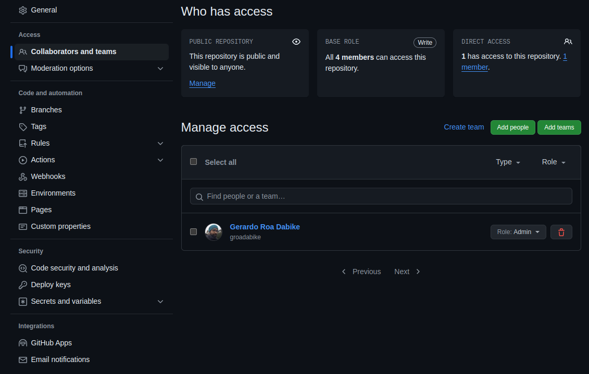

# Collaborating with others

Collaboration is a key aspect of working with GitHub. 
But, how do you collaborate with others on GitHub?

## Inviting collaborators

To collaborate with others on a project, the owner or administrator of the repo 
need to invite them to collaborate. This is done through the `Settings` tab of the repository.

Here are the steps to invite collaborators:

1. Go to the repository page.
2. Click on the `Settings` tab.
3. In the left sidebar, click on `Collaboration and teams`.
4. In Manage Access you can add collaborators by typing their GitHub username or email address.

Here you can invite people who will have an active role in your repository, like
- Developing new features
- Fixing bugs
- Reviewing code
- Managing issues and pull requests

## Forking a repository

As you may recall, a fork is a copy of a repository.
Imagine you find a project on GitHub that you want to contribute to,
but you don't have permission to make changes to the original repository.
In this case, you can fork the repository to create a copy of it in your GitHub account.
You can then make changes to the forked repository and submit a pull request to the
original repository to propose your changes.

