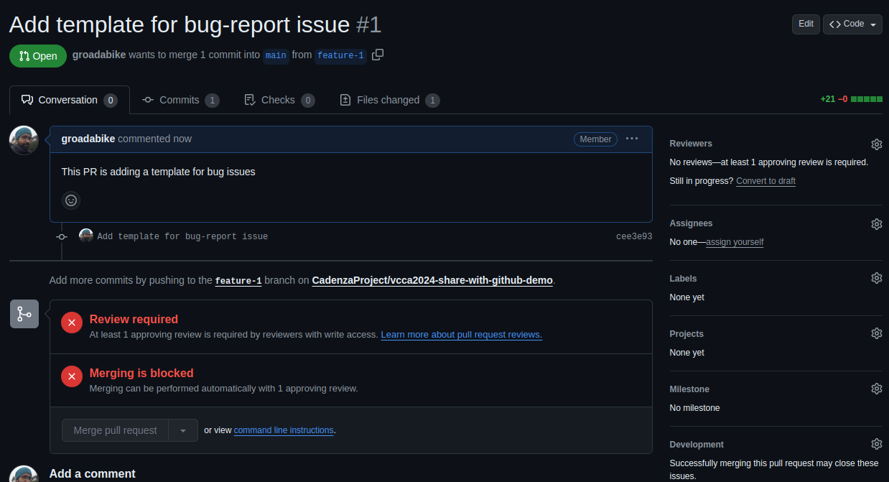
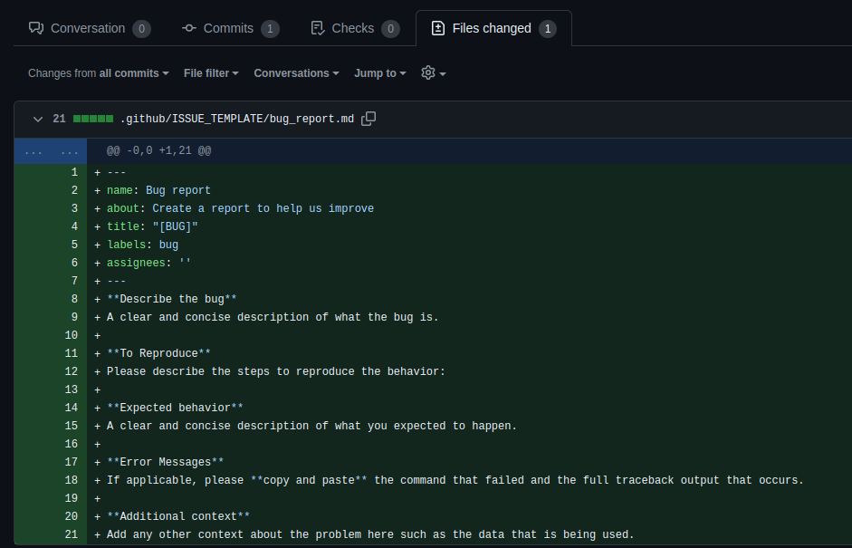

# Pull Request

## Creating a pull request (PR)

After making changes in the new branch, you can create a pull request to merge the changes into the `main` branch.
If you go to GitHub webpage, you will see a message saying that you have recently pushed a new branch and a button to create a pull request.


Click on the "Compare & pull request" button to start the process.

On the Open a pull request page, you will see a form to fill out with information about your PR.
You can add a title and description to explain the changes you made in the branch.



After filling out the form, click on the "Create pull request" button to submit the PR.
However, before merging the PR, you need to wait for the code to be reviewed by other collaborators.


```{admonition} Best Practices
:class: hint

* **Create a descriptive title**: The title should summarize the changes made in the PR.
* **Add a detailed description**: Explain the purpose of the changes, why they were made, and any relevant information.
* **Assign reviewers**: Assign one or more reviewers to the PR to ensure that the code is reviewed before merging.
* **Add labels**: Use labels to categorize the PR (e.g., bug fix, feature, documentation).
* **Link issues**: If the PR is related to an issue, [link the issue](https://docs.github.com/en/issues/tracking-your-work-with-issues/linking-a-pull-request-to-an-issue) in the description.
* **Keep the PR small**: Try to keep the changes in a PR small and focused on a single task.
* **Respond to feedback**: If reviewers provide feedback, address their comments and make the necessary changes.

```

## Reviewing a pull request

When a pull request is created, other collaborators can review the changes and provide feedback.
If collaborators ask you to make changes to the PR, you can make the changes locally, commit them, and push them to the same branch.
The changes will automatically be added to the PR.

To review a PR, click on the "Files changed" tab to see the differences between the branches.
You can leave comments on specific lines of code, ask questions, or suggest improvements.



The `+` and `-` symbols indicate lines that have been added or removed, respectively.

## Merging the pull request

Once the changes have been reviewed and approved, you can merge the PR into the `main` branch.
To merge the PR, click on the "Merge pull request" button on the PR page.

You will see a confirmation dialog asking you to confirm the merge.
Click on the "Confirm merge" button to merge the changes.

After the PR is merged, you can delete the branch if it is no longer needed.
Click on the "Delete branch" button to remove the branch from the repository.


After merging the PR, the changes will be reflected in the `main` branch.