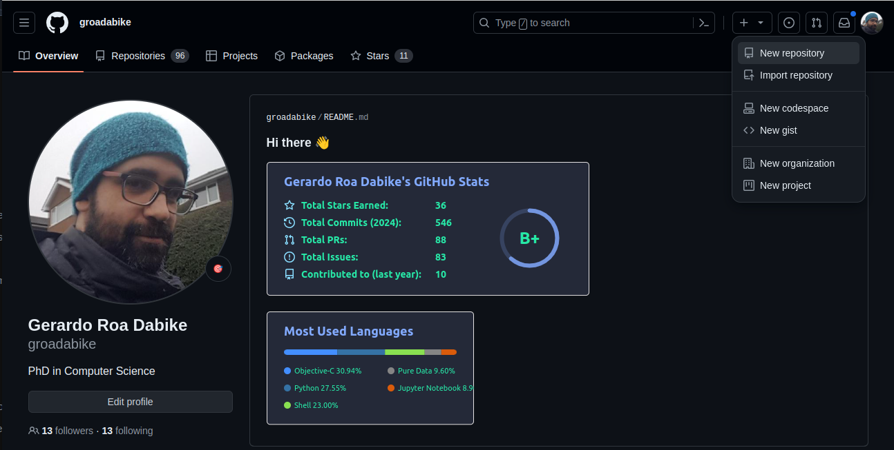
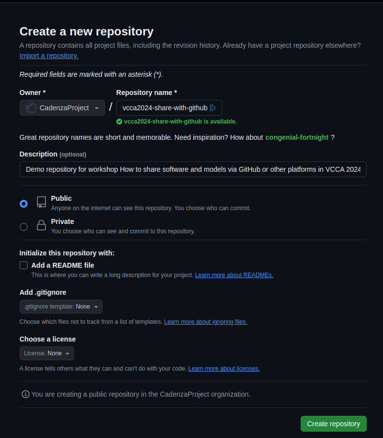
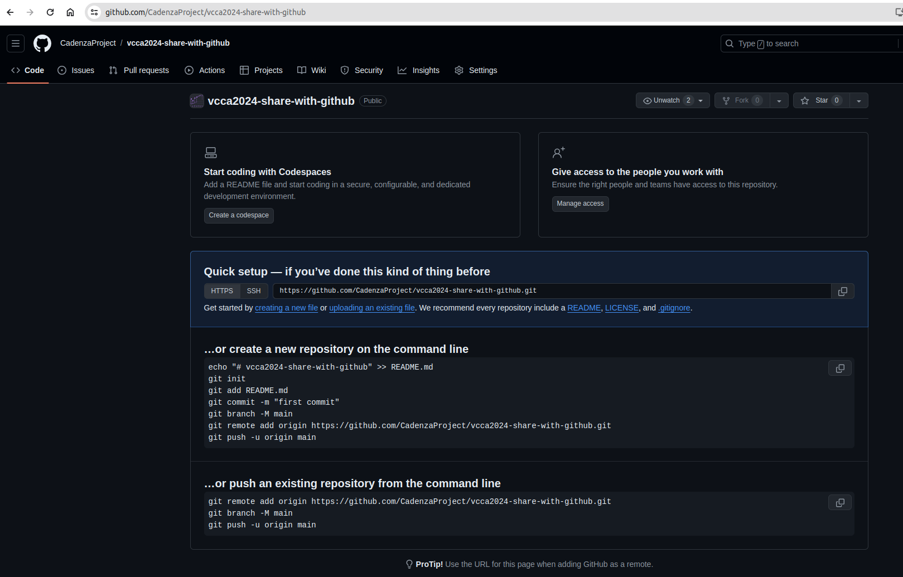

# First Repository

Let's assume you are working in a private project. You first need to create
your repository on GitHub. For this:

1. Go to [GitHub](https://github.com) and log in.
2. Click on the `+` sign in the top right corner and select `New repository`.

3. Fill in the repository name, description, and select if you want it to be public or private. Then click on `Create repository`.
Other options are available, but for now, we will keep it simple.

:::{note}
If you are part of a project, you might want to create a repository under the organization. In this case, you will need to select the organization in the `Owner` field.

Also, you can initialize the repository with a README file, a `.gitignore` file, and a license.
There is more information about these options in the GitHub documentation.
:::

4. Once the repository is created, you will see the repository page. You can see the URL of the repository in the address bar of your browser.

