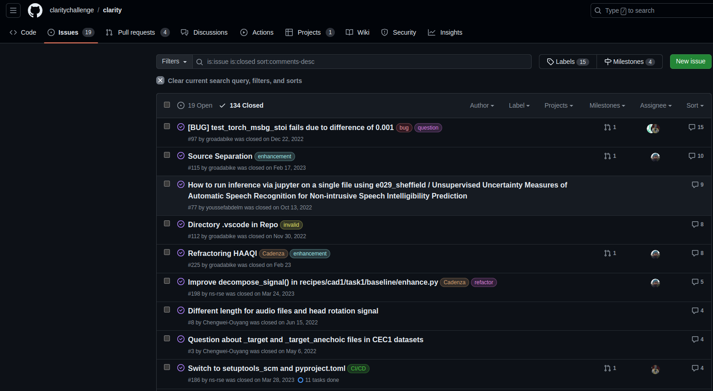

# Creating Issues Templates

Issues are a great way to keep track of tasks, enhancements, and bugs for your projects.
By creating issue templates, you can ensure that the necessary information is provided 
when creating a new issue and will tell people what information do you need.

To create an issue template, in your local repository, follow these steps:

1. Create a new directory called `.github` in the root of your repository
2. Inside the `.github` directory, create a new directory called `ISSUE_TEMPLATE`
3. Inside the `ISSUE_TEMPLATE` directory, create a new file called `bug_report.md`
4. Add the following content to the `bug_report.md` file:

```markdown
---
name: Bug report
about: Create a report to help us improve
title: "[BUG]"
labels: bug
assignees: ''
---
**Describe the bug**
A clear and concise description of what the bug is.

**To Reproduce**
Please describe the steps to reproduce the behavior:

**Expected behavior**
A clear and concise description of what you expected to happen.

**Error Messages**
If applicable, please **copy and paste** the command that failed and the full traceback output that occurs.

**Additional context**
Add any other context about the problem here such as the data that is being used.
```

We will use this issues later.

```{admonition} Other templates 
:class: hint

Issues are not only for reporting errors or bugs, but also for new features, 
improvements, and other tasks.

You can create different templates for different types of issues.

* `feature_request.md`
* `enhancement.md`
* `documentation.md`
* `question.md`
* `help_wanted.md`

You can create as many templates as you need and for different purposes. 
```

## Discussions in the ISSUE

When you create an issue, you can discuss the problem, the solution, 
and other aspects of the issue. You can also mention other collaborators
to ask for help or to review the issue.

This is a very useful tool to keep track of the progress of the issue and
to have a record of the decisions made during the resolution of the issue.

In the Issues tab on GitHub you can see all the issues created in the repository.
You can filter them by open, closed, and other criteria.



