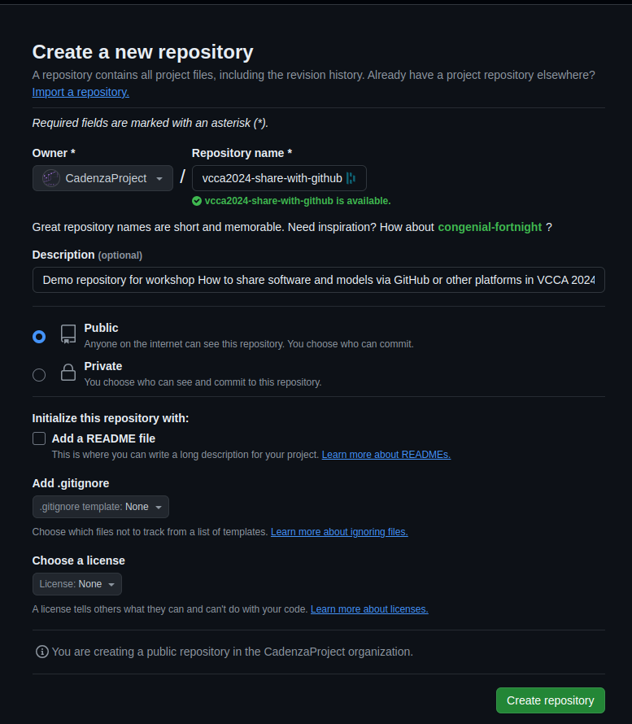
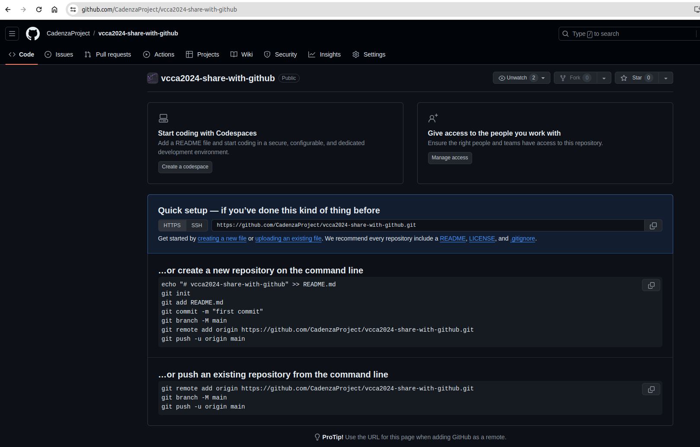
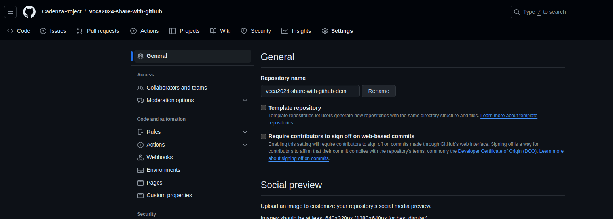

# Create First Repo

Let's assume you are working in a private project. You will need to first create
your repository on GitHub. For this:

1. If you are not already logged in, go to [GitHub](https://github.com) and log in.
2. Click on the `+` sign in the top right corner and select `New repository`.


3. Fill in the repository name, description, and select if you want it to be public or private. Then click on `Create repository`.
Other options are available, but for now, we will keep it simple.



>The description is optional, but it helps others better understand what the repository is about
>So, it is a good practice to add one or two sentences describing the content/objective of the repository.

>If later you want to share your repository with others, you can change it to public.

:::{admonition} Example:
I created a repository *named* `vcca2024-share-with-github`.
The *description* is `Repository for sharing code and files with the VCCA 2024 workshop participants`.
And, I selected the repository to be *public*.
:::


:::{note}
If you are part of a project, you might want to create a repository under the organization. 
For this, you will need to select the organization in the `Owner` field.
In the example, I selected `CadenzaProject` as owner, this means that the repository will be created under the organization 
`CadenzaProject`.

Additionally, you can initialize (which is a good practice) the repository with a 
README file, a .gitignore file, and a license. I'm skipping these steps for now to 
keep it simple, but I highly recommend initializing the repository with these files. 
More information about these options is available in the GitHub documentation.
:::

```{admonition} README.md file
:class: dropdown
It provides an introduction and overview of your project.
It should help visitors and collaborators understand what your project does, 
how to install it, and how to use it.
```

```{admonition} .gitignore file
:class: dropdown
It specifies files and directories that Git should ignore (not track) in your project.
It helps prevent committing files like editor-specific settings, compiled files, 
and sensitive information (e.g., API keys) to your repository.
```

```{admonition} LICENSE file
:class: dropdown
It specifies the terms under which others can use, modify, and distribute your code,
protecting your intellectual property rights and clarifies the legal obligations 
for users and contributors.
```

4. Once the repository is created, you will see the repository page. You can see the URL of the repository in the address bar of your browser.
Note that the repo URL is made of three parts: `https://github.com/<username>/<repository name>`:
- `https://github.com`: the base URL of GitHub.
- `username`: your GitHub username.
- `repository-name`: the name of the repository.




## Making changes to your repo

After a repository has been created, you can make changes to it like 
changing the repo name, description, adding files, etc.

### Change Name

To change the name of the repository:

1. Go to the repository page.
2. Click on the `Settings` tab.
3. In the `Repository name` field, change the name of the repository.
4. Click on `Rename`.

:::{admonition} Example:
I am changing the name `vcca2024-share-with-github` to `vcca2024-share-with-github-demo`.
:::


