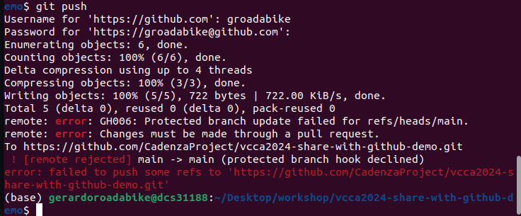

# Securing our repo

Now, we're going to make our repository more secure by adding a few 
layers of protection. This is a good practice to prevent unauthorized changes to our codebase.
We won't block people to collaborate, but we will make sure that only the right content 
is being pushed to the repository.

## Protect the main branch

As was mentioned before, the main branch is the most important branch in our repository.
It should always contain the latest stable version of our codebase.
We will protect the main branch to prevent unwanted changes by requiring pull request 
reviews before merging.

1. Go to the repository settings
2. Click on "Branches" in the left sidebar
3. Under "Branch protection rules", click on "Add classic branch protection rule"
4. In the "Branch name pattern" field, type `main`
5. Check the following options:
   - "Require pull request reviews before merging"
   - "Require status checks to pass before merging"
   - "Require branches to be up-to-date before merging"
   - "Do not allow bypassing the above settings"

With these settings, you will ensure that all changes are reviewed before merging 
into the main branch.

6. For any other rule, just pressed "Add rule" and repeat the process.

# Push changes in our protected branch

Let's try to push a commit in the `main` branch again 

1. In your computer, open `README.md` again
2. Add any text at the end
3. Run `git commit -a -m "improving readme"`
4. Push the changes to the remote repository as before by running `git push`.

:::{admonition} We got an error. What just happened?
:class: dropdown, error
The error message is telling us that we can't push directly to the main branch.
This is because we have protected the main branch, and we need to create a pull request
to merge our changes.

Let's do this in the next part.
:::

